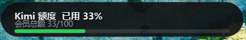
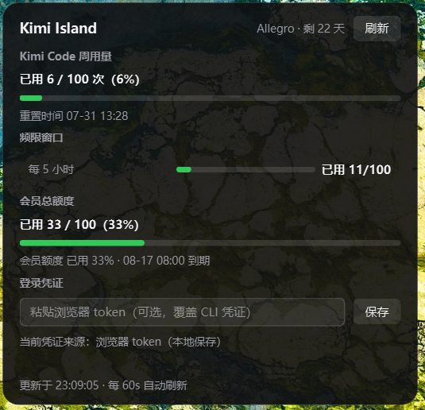
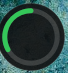

# 🏝️ Kimi Island

Kimi 订阅额度灵动岛 —— 一个悬浮在 Windows 屏幕顶部的桌面小工具，实时监控你的 Kimi 会员总额度、Kimi Code 周用量和频限窗口。

> 灵感来自 macOS Dynamic Island，专为 Windows 打造。

---

## 📸 预览

| 紧凑模式 | 展开模式 | 圆点模式 |
|---------|---------|---------|
|  |  |  |

---

## ✨ 功能特性

- **📊 实时额度监控** —— 自动拉取 Kimi 订阅数据，紧凑胶囊显示会员总额度使用率
- **⚡ 频限窗口详情** —— 按 API 实际返回的时间窗口动态展示（如"每 5 小时"），不会丢失或错标
- **👑 会员总额度** —— 展示订阅会员的 credit 总用量与到期时间
- **🎨 智能预警** —— 剩余额度低于阈值自动变色（绿 → 黄 → 红），轮询间隔自适应（15s ~ 60s）
- **🗕 三种形态** —— 紧凑胶囊 / 展开面板 / 圆点，点击展开、移开或点击外部自动收起
- **🖱️ 自由拖动** —— 任意形态下都可拖动，位置自动记忆
- **🔑 免配置登录** —— 自动读取 Kimi CLI 凭证，过期时自动回退到本地保存的浏览器 token
- **📌 置顶悬浮** —— 始终悬浮在最顶层，不影响其他窗口操作

---

## 📥 下载

从 [Releases](../../releases/latest) 页面下载 `kimi-island.exe`，双击即可运行，**无需安装 Python 或任何依赖**。

> 系统要求：Windows 10 1903+ / Windows 11（x64）

首次运行后，悬浮胶囊会出现在屏幕顶部中央，系统托盘出现 "K" 图标（右键：显示/隐藏、收起为圆点、立即刷新、退出）。

---

## 🔑 登录凭证

程序**自动**获取登录凭证，通常无需任何操作：

1. **Kimi CLI 凭证（优先）** —— 如果你在电脑上登录过 [Kimi CLI](https://www.kimi.com/code)，程序会自动读取 `~/.kimi/credentials/kimi-code.json`
2. **浏览器 token（自动回退 / 手动覆盖）** —— CLI 凭证过期时，自动使用本地保存的浏览器 token；也可以随时在展开面板中手动粘贴新的 token 覆盖

手动获取浏览器 token 的步骤：

1. 浏览器访问 [kimi.com/code/console](https://kimi.com/code/console) 并登录
2. 按 `F12` 打开开发者工具
3. 切换到 **Application** → **Local Storage** → `https://kimi.com`
4. 复制 `access_token` 的值（通常以 `eyJhbG...` 开头）
5. 粘贴到灵动岛展开面板的输入框，点击「保存」

> Token 仅保存在本地 `%APPDATA%\kimi-island\config.json`，不会上传到任何服务器。

---

## 🛠️ 从源码运行

```powershell
# 需要 Python 3.10+
python -m venv .venv
.\.venv\Scripts\python.exe -m pip install -r requirements.txt
.\.venv\Scripts\python.exe -m kimi_island.main

# 调试模式：转储 API 原始 JSON 到 %APPDATA%\kimi-island\debug
.\.venv\Scripts\python.exe -m kimi_island.main --debug

# 命令行验证（无界面，打印一次额度数据）
.\.venv\Scripts\python.exe fetch_once.py --debug
```

## 📦 打包 exe

```powershell
.\.venv\Scripts\python.exe -m PyInstaller --noconfirm kimi-island.spec
# 产物在 dist\kimi-island.exe
```

## 🧪 测试

```powershell
.\.venv\Scripts\python.exe -m pytest tests -q
```

---

## ⚙️ 技术栈

- **框架**: Python 3.12 + PySide6 (Qt 6)
- **网络**: requests（Kimi Connect Protocol 内部 Web API）
- **打包**: PyInstaller（单文件绿色 exe）
- **配置**: `%APPDATA%\kimi-island\config.json`

## ⚠️ 免责声明

本项目调用的 Kimi 内部接口无官方文档，可能随时变动；仅供个人学习使用，与 Moonshot AI 无任何隶属关系。

## 🙏 致谢

本项目参考了 [nekocharm1207/kimi-island](https://github.com/nekocharm1207/kimi-island)（Tauri + React 实现）的 Kimi API 调用方式，在此基础上用 Python + PySide6 重写。

## 📄 开源协议

MIT License
